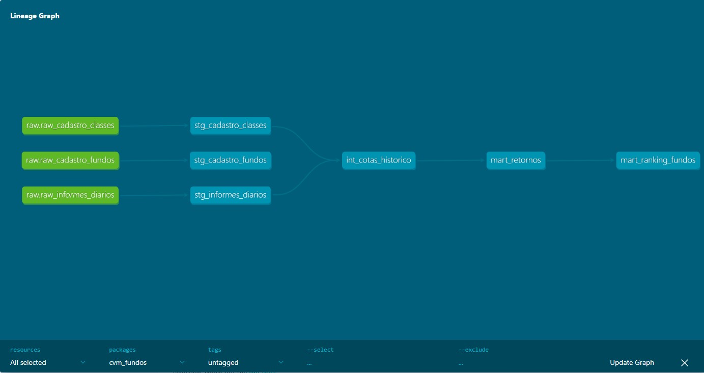
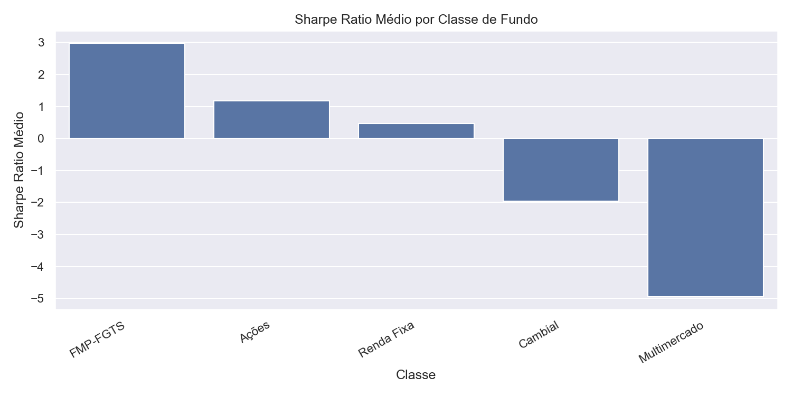
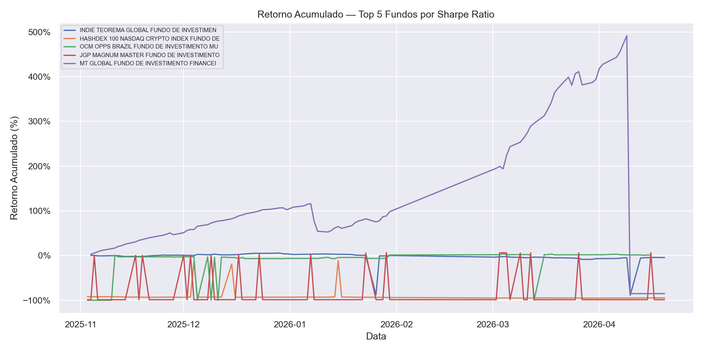

# Análise de Fundos CVM com dbt + DuckDB

Pipeline ELT completo para análise de fundos de investimento brasileiros com dados públicos da CVM.
Processa **2,4 milhões de registros** de **25.274 fundos** com métricas financeiras reais.

## Arquitetura



O projeto segue a arquitetura de 3 camadas padrão de mercado com dbt:

- **Staging** — limpeza e padronização das fontes brutas
- **Intermediate** — série histórica com retorno diário via window functions
- **Marts** — Sharpe Ratio, drawdown máximo, retorno acumulado e ranking por classe

## Resultados

### Top 10 Fundos por Sharpe Ratio

| # | Fundo | Classe | Sharpe | Retorno Acum. | Drawdown Máx. | PL (R$ mi) |
|---|-------|--------|--------|----------------|----------------|------------|
| 1 | GOLDEN SKY MM CRÉDITO PRIVADO | Multimercado | 7.86 | 27.45% | -0.04% | 29.4 |
| 2 | KSK MM CREDITO PRIVADO | Multimercado | 7.13 | 138.99% | -3.40% | 126.4 |
| 3 | ABIATAR FIC MM CRÉDITO PRIVADO | Multimercado | 7.07 | 48.27% | -0.77% | 133.3 |
| 4 | JP MM CRÉDITO PRIVADO | Multimercado | 6.95 | 47.92% | -0.07% | 550.7 |
| 5 | ANGOPHORA FIF | Renda Fixa | 5.69 | - | - | - |

> Fundos com Sharpe > 1 com PL mínimo de R$ 1M e histórico mínimo de 60 dias.
> Selic de referência: 13,75% a.a. (abril/2026)

### Sharpe Ratio Médio por Classe



### Retorno Acumulado — Top 5 Fundos



## Volume de Dados

| Métrica | Valor |
|---------|-------|
| Fundos analisados | 25.274 |
| Registros de informes | 2.449.840 |
| Período coberto | Nov/2025 – Abr/2026 |
| Fonte | dados.cvm.gov.br |

## Stack Técnica

| Camada | Tecnologia |
|--------|------------|
| Transformação | dbt Core 1.11.8 |
| Banco analítico | DuckDB 1.5.0 |
| Linguagem | Python 3.12 |
| Ingestão | requests, zipfile |
| Análise | pandas, matplotlib, seaborn |

## Como Rodar

```bash
# 1. Clonar e criar ambiente
git clone https://github.com/gentleman0xc/cvm-dbt-analysis.git
cd cvm-dbt-analysis
python -m venv .venv
.venv\Scripts\Activate.ps1  # Windows

# 2. Instalar dependências
pip install -r requirements.txt

# 3. Configurar dbt
cp profiles.yml.example ~/.dbt/profiles.yml

# 4. Baixar dados da CVM
python ingestion/download_cvm.py

# 5. Carregar no DuckDB
python ingestion/load_to_duckdb.py

# 6. Rodar pipeline dbt
cd cvm_fundos
dbt build
```

## Estrutura do Projeto
```
cvm-dbt-analysis/
├── ingestion/
│   ├── download_cvm.py       # baixa CSVs da CVM (.zip → .csv)
│   └── load_to_duckdb.py     # carrega no banco com deduplicação
├── cvm_fundos/               # projeto dbt
│   └── models/
│       ├── staging/          # limpeza e padronização
│       ├── intermediate/     # retorno diário com LAG + PARTITION BY
│       └── marts/            # Sharpe, drawdown, ranking
├── analysis/
│   └── exploratory.ipynb     # gráficos e análise exploratória
└── docs/
    ├── lineage.jpg           # grafo de dependências dbt
    ├── retorno_acumulado.png
    └── sharpe_por_classe.png
```

## Decisões Técnicas

**DuckDB** foi escolhido por ser um banco colunar analítico otimizado para queries de agregação em séries temporais — significativamente mais rápido que SQLite para calcular métricas de 25 mil fundos. Roda como arquivo local sem servidor.

**dbt** organiza as transformações em camadas com dependências explícitas via `{{ ref() }}`, testes automáticos de qualidade e documentação integrada. O comando `dbt build` roda modelos e testes em sequência.

**Resolução CVM 175** — a CVM migrou os fundos para nova estrutura em 2024. O cadastro legado (`cad_fi.csv`) tinha 46.566 fundos cancelados. O novo cadastro (`registro_fundo_classe.zip`) usa CNPJ como inteiro, enquanto os informes usam string formatada — resolvido com normalização no staging.